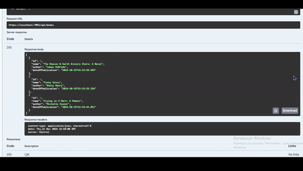

# Books API

### REST API:

### Technical Information
This is ASP.NET Core Web API project. I used such NuGet packages: Microsoft.EntityFrameworkCore, MySql.EntityFrameworkCore. 
I worked with MySQL, so there is a class where I connect to Database. 
For book model I created Repository where I work with books data. 
In Propram.cs I used Dependency Injection with BookContext and BookRepository.
